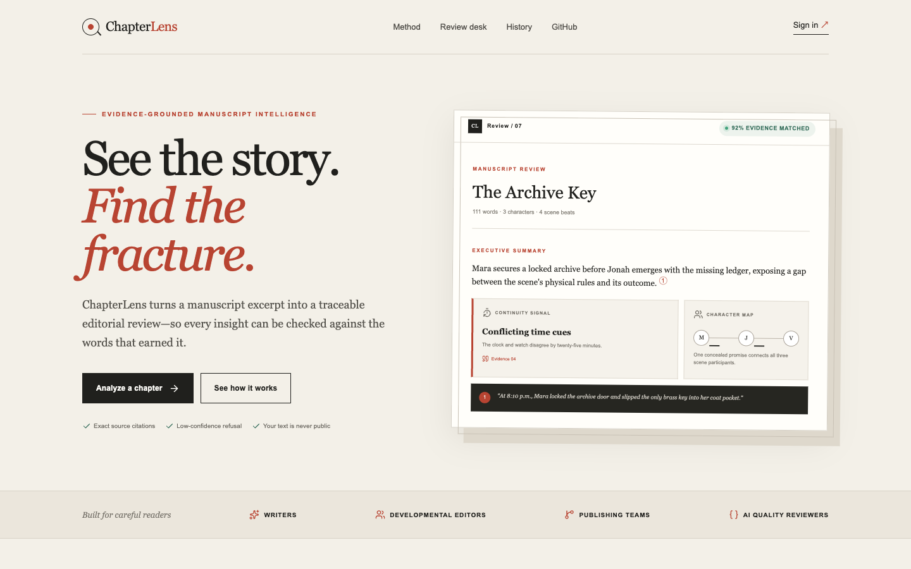
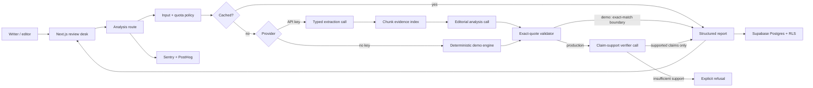

# ChapterLens

**Evidence-grounded AI manuscript analysis for writers and editors.**

ChapterLens turns a novel chapter or long excerpt into a structured editorial review: summary, characters, relationships, timeline, continuity signals, pacing, and revision suggestions. Every analytical claim links to an exact source quote. If the source cannot support a claim, the validation layer removes it; if it cannot support the summary, the product refuses clearly.

> Portfolio status: the public demo is live and the complete repository is verified by GitHub Actions. The hosted site intentionally runs the deterministic, zero-cost demo engine until Supabase and OpenAI production keys are configured.

- **Live demo:** [chapterlens.vercel.app](https://chapterlens.vercel.app)
- **CI:** [latest GitHub Actions run](https://github.com/Maxma1104/chapterlens-ai/actions)
- **Evaluation:** [55-case baseline](evaluations/results/REPORT.md)



## Why this is more than an API wrapper

The production provider separates five concerns across three typed model stages and one deterministic boundary:

1. Input policy and text segmentation
2. Structured extraction and editorial reasoning
3. Exact-quote evidence normalization
4. Unsupported-claim removal and low-confidence refusal
5. Persistence, quota, cost, feedback, and evaluation

The result is inspectable. A reviewer can click citation `3`, see the original span highlighted, and decide whether the conclusion is warranted.

## Product surface

- Editorial landing page and project story
- Passwordless email authentication with Supabase
- Paste or `.txt` upload with a 50,000-character cap
- Five-stage analysis progress and retry states
- Summary, character map, relationships, timeline, continuity, pacing, and revision plan
- Exact citation navigation with source highlighting
- Local demo history plus signed-in Supabase history
- Helpful / not-yet feedback capture
- Five analyses per user per UTC day
- Health check, Sentry errors, PostHog product events, and cost metadata
- Responsive layouts for desktop and mobile

## Architecture



More detail: [architecture](docs/ARCHITECTURE.md) and [initial ADR](docs/decisions/0001-grounding-pipeline.md).

## Stack

| Layer | Choice | Why |
| --- | --- | --- |
| Product | Next.js 16, React 19, TypeScript | One deployable unit with server routes and App Router |
| UI | Tailwind 4 + handcrafted editorial CSS | Fast iteration without a generic dashboard aesthetic |
| AI | OpenAI Responses API + strict Zod output | Typed structured responses and provider usage metadata |
| Grounding | Exact substring validation | Simple, falsifiable, and impossible to fake with a close paraphrase |
| Data | Supabase Postgres, Auth, Storage, pgvector | RLS-backed ownership, private uploads, future retrieval seam |
| Quality | Vitest, Playwright, 55-case evaluator | Unit, integration, browser, and AI-behavior evidence |
| Operations | Sentry, PostHog, Vercel | Errors, product events, and serverless deployment |

The framework and auth setup follow the current official [Next.js App Router](https://nextjs.org/docs/app) and [Supabase SSR](https://supabase.com/docs/guides/auth/server-side) guidance. AI calls use the official [OpenAI Responses API](https://platform.openai.com/docs/api-reference/responses).

## Run locally

Requirements: Node.js 22+ and npm 10+.

```bash
npm install
cp .env.example .env.local
npm run dev
```

Open `http://localhost:3000`. With empty cloud variables, ChapterLens uses the deterministic demo engine and browser-local history. Click **Load example** to exercise the complete flow.

### Enable production services

1. Create a Supabase project and run `database/migrations/0001_initial.sql`.
2. Add the Supabase URL and publishable key to `.env.local`.
3. Add `OPENAI_API_KEY`; optionally set the model and current per-million-token pricing.
4. Add Sentry and PostHog keys if monitoring is required.
5. Follow [deployment.md](docs/DEPLOYMENT.md) to configure Vercel and auth redirects.

No secret is required in the browser. Manuscripts belong to the authenticated user through Postgres RLS; the storage bucket is private.

## Verify the product

```bash
npm run lint
npm run typecheck
npm test
npm run test:e2e
npm run build
npm run eval
```

The committed evaluation suite contains 55 cases across character extraction, chronology, contradiction, clean-text, prompt-injection, long-input, and fail-closed refusal-policy probes. Exact-citation metrics prove quote presence—not claim entailment. Until an independent judged OpenAI run exists, model claim-support accuracy and hallucination rate are deliberately reported as “Not run.” See [the latest report](evaluations/results/REPORT.md).

Do not quote the deterministic demo baseline as model quality. Run `npm run eval` with the intended production model and commit the resulting provider-specific report before publishing metrics.

## Failure and cost controls

- 120–50,000 character input window
- Strict schema validation at both request and model boundaries
- Exact source-substring validation and repaired offsets
- Claims with missing or invalid evidence are dropped
- Explicit refusal when the summary has no valid evidence
- Two provider retries, 90-second timeout, 120-second route ceiling
- Content-addressed 24-hour cache with bounded memory
- Atomic five-per-day quota and monthly dollar ceiling for signed-in users; IP fallback in local demo mode
- Configurable token-price calculation and per-analysis cost storage
- No raw error objects returned to users

The deliberate limitation: the demo cache and anonymous quota are process-local, and anonymous requests always use the zero-cost deterministic engine. Authenticated production quota and monthly spend reservations are durable and atomic in Postgres. A distributed cache would be the next change at sustained multi-instance traffic.

## Portfolio guide

- [Case study](docs/CASE_STUDY.md) — problem, decisions, tradeoffs, results
- [Two-minute demo script](docs/DEMO_SCRIPT.md) — screen-by-screen recording plan
- [Interview guide](docs/INTERVIEW_GUIDE.md) — five-minute system explanation and likely questions
- [Security model](docs/SECURITY.md) — threat model and controls
- [Roadmap](docs/ROADMAP.md) — scoped next steps, not speculative MVP bloat

## Repository map

```text
app/                 routes, product pages, API handlers
components/          landing, review desk, report, history UI
lib/analysis/        schemas, provider orchestration, evidence validation
lib/supabase/        auth, persistence, configuration
database/migrations/ Postgres, pgvector, RLS, quotas, private storage
evaluations/         55-case dataset, runner, latest metrics
tests/               unit, integration, browser flows
docs/                architecture, case study, interview and deployment
.github/workflows/   automated verification
```

## License

MIT. See [LICENSE](LICENSE).
