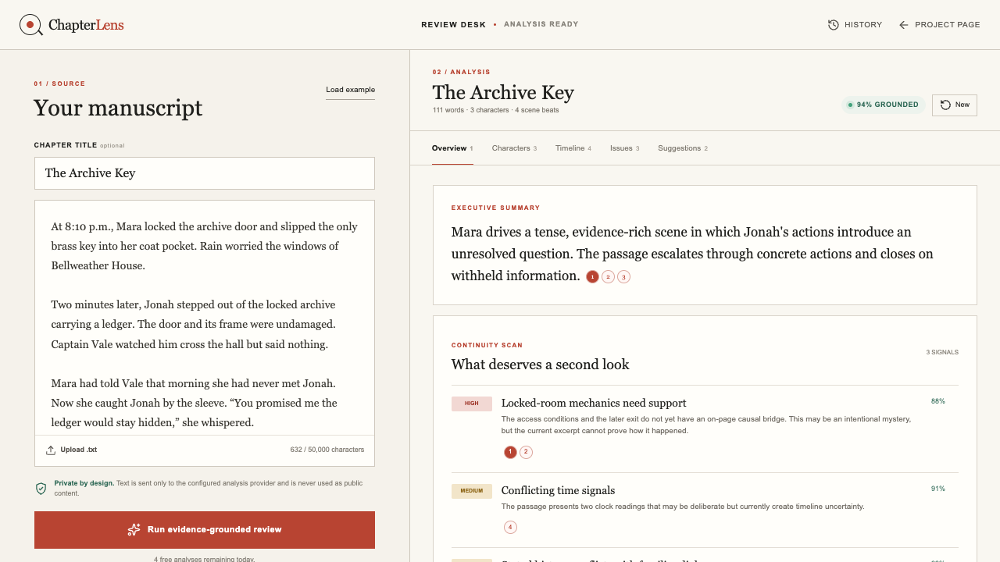

# Case study: ChapterLens

## Outcome

ChapterLens is a deployable manuscript review product that makes AI editorial judgment auditable. It demonstrates product engineering, structured LLM workflows, evaluation, reliability, and cost control in one coherent user journey.

## User problem

Writers can get fast feedback from general-purpose chat tools, but the feedback is hard to trust. Claims often blur source facts with inference, quotes may be approximate, and a confident answer can hide weak evidence. Editors also lose time moving between a critique and the exact passage it refers to.

The product job is therefore not “generate more feedback.” It is “reduce the cost of verifying useful feedback.”

## Scope decision

The MVP accepts pasted text or `.txt`, one excerpt at a time, up to 50,000 characters. It includes authentication, history, grounded review, feedback, limits, monitoring, and evaluation. PDF, DOCX, multi-book graphs, version comparison, and PDF export remain outside the first release.

This cut is defensive: each new format or project hierarchy adds parsing and data-lifecycle risk before it improves the central proof—evidence-grounded analysis.

## Key decisions

### Exact quotations over similarity scores

Embeddings are useful for finding candidate passages. They are not proof that a generated quote exists. ChapterLens requires exact substrings at the final boundary and rebuilds character offsets on the server.

### Extraction before judgment

The output contract separates evidence, characters, relationships, timeline, findings, pacing, and suggestions. That keeps each claim addressable and makes evaluation possible.

### Honest no-key mode

The repository must be useful to a reviewer without paid credentials. A deterministic engine powers the full UI and citation flow locally, and its metadata says exactly what it is. Production switches to OpenAI only when a key exists.

### Durable limits for users, cheap fallback for demos

Authenticated quotas are atomic in Postgres. Anonymous local requests use process memory. The fallback is intentionally documented as non-distributed instead of pretending to be production rate limiting.

## What was difficult

The hardest boundary was not model calling; it was representing claims so support could be mechanically checked. Requiring evidence IDs on every analytical node created a stable contract for UI citations, refusal, evaluation, and future retrieval.

The second difficulty was product coherence. Authentication, progress, error states, history, feedback, and evidence navigation had to feel like one editorial workflow rather than separate technical demos.

## Evaluation

The evaluator covers 50 cases in five groups: characters, timeline, contradictions, clean/adversarial prose, and unsupported-claim refusal probes. It measures exact citation accuracy, character recall, contradiction classification, refusal accuracy, hallucinated citation rate, latency, and estimated cost.

The repository commits a deterministic-engine baseline only. Before using metrics in a résumé, the production model should be evaluated with pinned model ID, date, dataset revision, and pricing.

## Current limits

- One excerpt per analysis; no cross-chapter memory yet
- `.txt` only in the MVP
- Exact quotes support auditability but not entailment; a real quote can still be interpreted badly
- Anonymous cache and quota are process-local
- The 50-case set is synthetic and must be supplemented with licensed, human-annotated manuscripts

## Next experiment

The highest-value next step is not another feature. It is a blind editor study: 20 real excerpts, two reviewers, and side-by-side scoring for usefulness, support, and time-to-verify. If ChapterLens does not reduce verification time without lowering editorial quality, richer retrieval will not fix the product.
